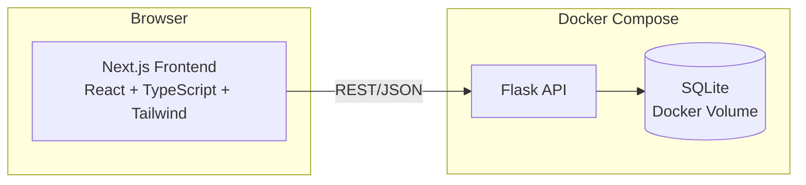
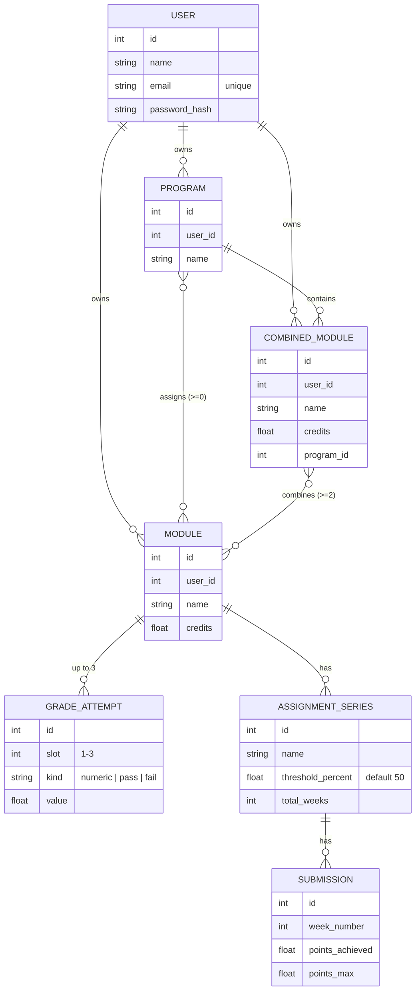

# 🎓 Grade Tracker

A self-hosted tool for tracking study programs, modules, grades and weekly
assignment submissions (exam admission requirements) across a double-degree
or multi-program setup. Built for a Mathematics/Physics double degree with
additional Economics modules — but useful for any program with multiple
degree tracks, combined modules and weekly problem sets.


## Why

In a double degree (or minor/major combinations), keeping track of grades
gets messy fast: modules count differently across programs, some modules
get merged into combined modules, and exam admission depends on separately
clearing a minimum score in several weekly assignment series (problem
sets, programming exercises, …). Grade Tracker models exactly that, instead
of rebuilding it in a spreadsheet every semester.

## Features

- **Multi-user** – sign up with name/email/password (no email verification
  required), log in/out, edit your profile. All data is strictly isolated
  per user.
- **Manage degree programs** – add, rename and delete as many programs as
  you like (e.g. Mathematics, Physics, Economics). Modules without an
  assignment automatically fall under "Other".
- **Modules in multiple programs** – a module can be credited in several
  programs at once, each assignment counted independently (same principle
  as combined modules, see below).
- **Modules with up to 3 grade attempts** – each attempt is either a grade
  (German scale 1.0–5.0) or "passed"/"failed". The best attempt counts
  automatically.
- **Weekly assignments & exam admission** – any number of assignment
  series per module (e.g. a weekly "problem set" and a bi-weekly
  "programming exercise"), each with its own admission threshold (default
  50%). Log points per week, see progress live.
- **Combined modules** – merge several modules into one module with its
  own credits and averaged grade (e.g. *Calculus* + *Linear Algebra* →
  *Math for Physicists*), independent of how the source modules count in
  their own program.
- **Credit-weighted grade average** – per program and overall, with
  special handling for ungraded "passed" modules (count toward credits,
  not toward the average).
- **Dashboard** – overall average, credits per program and open exam
  admissions at a glance.

## Architecture



The business logic (grade average calculation, exam admission logic,
combined-module averaging) deliberately lives separate from the web layer
in [`backend/app/grading.py`](backend/app/grading.py) — pure, independently
testable functions with no Flask or database dependency
(see [`backend/tests/test_grading.py`](backend/tests/test_grading.py)).

### Data model



A module with no program assignment is "Other"; with several assignments
it counts independently in each one (many-to-many via an association
table, the same principle used for a combined module's source modules).

## Tech Stack

| Area     | Technology |
|----------|------------|
| Backend  | Flask 3, Flask-SQLAlchemy, SQLite, pytest, gunicorn |
| Frontend | Next.js 16 (App Router), React 19, TypeScript, Tailwind CSS 4 |
| Infra    | Docker, Docker Compose |

## Setup

Requires [Docker](https://docs.docker.com/get-docker/) & Docker Compose.

```bash
git clone <this-repo>
cd grade_tracker
docker compose up --build
```

- Frontend: http://localhost:3001
- Backend API: http://localhost:5001/api

> Ports can be changed via `NEXT_PUBLIC_API_URL` (see `.env.example`) or the
> `ports:` mapping in `docker-compose.yml` if they're already taken locally.
> For anything beyond local use, also set `SECRET_KEY` (signs login tokens)
> to your own random value in a `.env` file — see `.env.example`.

Sign up via the web UI first (`/signup`), then log in. Optionally, seed
some example data (Calculus, Linear Algebra, the combined module "Math for
Physicists", …) under a demo login:

```bash
docker compose exec backend python seed.py
# Demo login: demo@example.com / demo12345
```

### Local development without Docker

```bash
# Backend
cd backend
python -m venv .venv && source .venv/bin/activate
pip install -r requirements.txt
FLASK_APP=wsgi.py flask run --port 5001

# Frontend (separate terminal)
cd frontend
npm install
NEXT_PUBLIC_API_URL=http://localhost:5001 npm run dev
```

### Tests

```bash
cd backend
source .venv/bin/activate
pytest
```

The grading logic (`grading.py`) is fully unit-tested; the API routes are
covered by Flask test-client tests.

## API Overview

All endpoints under `/api`, JSON-based. Except for `/api/health` and
`/api/auth/register`/`/api/auth/login`, every endpoint requires an
`Authorization: Bearer <token>` header and only returns the signed-in
user's data.

| Method & Path | Purpose |
|---|---|
| `POST /auth/register` | Sign up (`name`, `email`, `password`) → token |
| `POST /auth/login` | Log in (`email`, `password`) → token |
| `GET /auth/me` | Get the current user |
| `PATCH /auth/me` | Change name/email/password (`current_password` required) |
| `GET/POST /studiengaenge` | List / create degree programs |
| `PATCH/DELETE /studiengaenge/<id>` | Rename / delete |
| `GET/POST /module` | List modules (optional `?studiengang_id=`) / create (`studiengang_ids: []`) |
| `GET/PATCH/DELETE /module/<id>` | Read / edit / delete a module |
| `POST /module/<id>/grades` | Set a grade attempt (slot 1–3) |
| `DELETE /grades/<id>` | Delete a grade attempt |
| `POST /module/<id>/series` | Create an assignment series |
| `PATCH/DELETE /series/<id>` | Edit / delete an assignment series |
| `POST /series/<id>/submissions` | Log a weekly submission |
| `PATCH/DELETE /submissions/<id>` | Edit / delete a submission |
| `GET/POST /kombimodule` | List / create combined modules |
| `PATCH/DELETE /kombimodule/<id>` | Edit / delete a combined module |
| `GET /stats/overview` | Grade average & exam-admission status per program + overall |

## Project Structure

```
grade_tracker/
├── backend/
│   ├── app/
│   │   ├── grading.py       # pure calculation logic (average, admission, combined-module averaging)
│   │   ├── auth.py          # bearer token issuing/verification, login_required
│   │   ├── models.py        # SQLAlchemy models
│   │   └── routes/          # Flask blueprints (REST endpoints, incl. auth.py)
│   ├── tests/                # pytest
│   └── seed.py                # example data incl. demo user
└── frontend/
    └── src/
        ├── app/                # Next.js App Router pages (incl. login/signup/account)
        ├── components/         # UI building blocks (ProgressBar, GradeBadge, ConfirmDialog, …)
        └── lib/                # API client, types, AuthContext
```

## License

[MIT](LICENSE)
