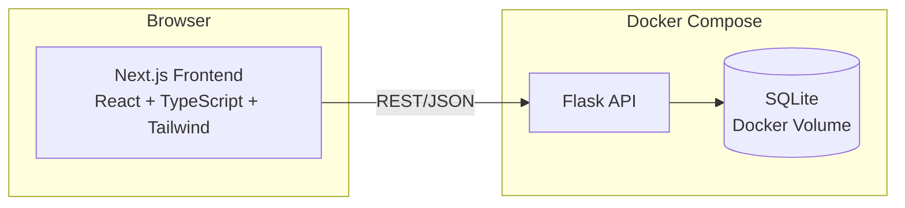
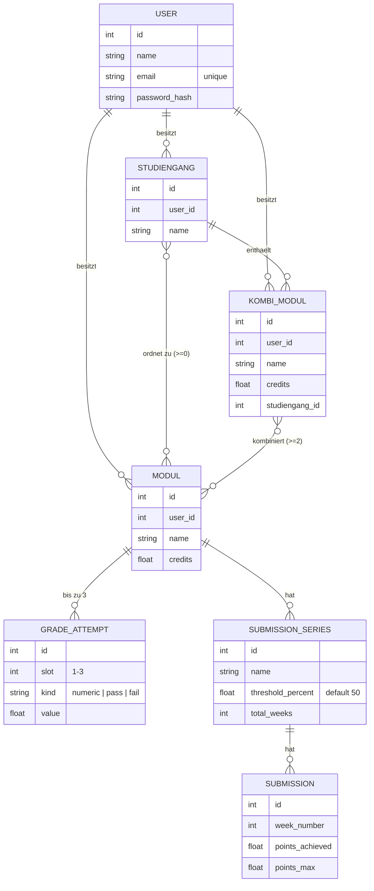

# 🎓 Grade Tracker

Ein selbstgehostetes Tool, um Studiengänge, Module, Noten und wöchentliche
Übungs-Abgaben (Klausurzulassungen) über ein Doppelstudium oder mehrere
Nebenfächer hinweg im Blick zu behalten. Gebaut für ein Mathe/Physik-Doppelbachelor
mit zusätzlichen VWL-Modulen — aber allgemein für jedes Studium mit mehreren
Studiengängen, Kombi-Modulen und wöchentlichen Übungsblättern nutzbar.


## Warum

Bei einem Doppelbachelor (oder Nebenfach-Kombinationen) lässt sich der
Notenüberblick schnell unübersichtlich: Module zählen in unterschiedlichen
Studiengängen unterschiedlich, manche Module werden zu Kombi-Modulen
zusammengelegt, und für die Klausurzulassung müssen mehrere wöchentliche
Übungsserien (Rechenblatt, Programmierblatt, …) getrennt eine Mindestpunktzahl
erreichen. Grade Tracker bildet genau dieses Modell ab, statt es in einer
Tabellenkalkulation nachzubauen.

## Features

- **Mehrbenutzerfähig** – Registrierung mit Name/E-Mail/Passwort (ohne
  E-Mail-Verifizierung), Login/Logout, Profil bearbeiten. Alle Daten sind
  strikt pro Nutzer isoliert.
- **Studiengänge verwalten** – beliebig viele Studiengänge (z. B. Mathematik,
  Physik, VWL) anlegen, umbenennen, löschen. Module ohne Zuordnung landen
  automatisch unter „Sonstiges".
- **Module in mehreren Studiengängen** – ein Modul kann gleichzeitig in
  mehreren Studiengängen angerechnet werden, jede Zuordnung zählt
  unabhängig (gleiches Prinzip wie bei Kombi-Modulen).
- **Module mit bis zu 3 Notenversuchen** – jeder Versuch ist entweder eine
  Note (deutsche Skala 1,0–5,0) oder „bestanden"/„nicht bestanden". Es zählt
  automatisch die beste Note.
- **Wöchentliche Übungs-Abgaben & Klausurzulassung** – pro Modul beliebig
  viele Übungsserien (z. B. „Rechenblatt" wöchentlich, „Programmierblatt"
  alle zwei Wochen), je mit eigener Zulassungsschwelle (Standard 50 %).
  Punkte pro Woche eintragen, Fortschritt live sehen.
- **Kombi-Module** – mehrere Module zu einem eigenen, credit-gewichteten
  Modul mit gemittelter Note zusammenfassen (z. B. *Analysis* + *Lineare
  Algebra* → *Mathe für Physiker*), unabhängig davon, wie die Quellmodule in
  ihrem eigenen Studiengang zählen.
- **Credit-gewichteter Notenschnitt** – je Studiengang und insgesamt,
  inklusive Sonderbehandlung von unbenoteten „bestanden"-Modulen (zählen zu
  Credits, nicht zum Schnitt).
- **Dashboard** – Gesamtschnitt, Credits je Studiengang und offene
  Klausurzulassungen auf einen Blick.

## Architektur



Die Business-Logik (Notenschnitt-Berechnung, Zulassungs-Logik,
Kombi-Modul-Mittelung) lebt bewusst getrennt vom Web-Layer in
[`backend/app/grading.py`](backend/app/grading.py) — reine, unabhängig
testbare Funktionen ohne Flask- oder Datenbank-Abhängigkeit
(siehe [`backend/tests/test_grading.py`](backend/tests/test_grading.py)).

### Datenmodell



Ein Modul ohne Studiengang-Zuordnung gilt als „Sonstiges"; mit mehreren
Zuordnungen zählt es unabhängig in jedem zugeordneten Studiengang (M:N über
eine Assoziationstabelle, analog zu den Quellmodulen eines Kombi-Moduls).

## Tech-Stack

| Bereich  | Technologie |
|----------|-------------|
| Backend  | Flask 3, Flask-SQLAlchemy, SQLite, pytest, gunicorn |
| Frontend | Next.js 16 (App Router), React 19, TypeScript, Tailwind CSS 4 |
| Infra    | Docker, Docker Compose |

## Setup

Voraussetzung: [Docker](https://docs.docker.com/get-docker/) & Docker Compose.

```bash
git clone <this-repo>
cd grade_tracker
docker compose up --build
```

- Frontend: http://localhost:3001
- Backend-API: http://localhost:5001/api

> Ports lassen sich über `NEXT_PUBLIC_API_URL` (siehe `.env.example`) bzw. die
> `ports:`-Zuordnung in `docker-compose.yml` anpassen, falls sie lokal belegt
> sind. Für produktivere Nutzung solltest du außerdem `SECRET_KEY` (signiert
> die Login-Tokens) in einer `.env`-Datei auf einen eigenen Zufallswert
> setzen – siehe `.env.example`.

Zuerst über die Weboberfläche registrieren (`/signup`), dann anmelden.
Optional lassen sich Beispieldaten (Analysis, Lineare Algebra, das
Kombi-Modul „Mathe für Physiker", …) unter einem Demo-Login einspielen:

```bash
docker compose exec backend python seed.py
# Demo-Login: demo@example.com / demo12345
```

### Lokale Entwicklung ohne Docker

```bash
# Backend
cd backend
python -m venv .venv && source .venv/bin/activate
pip install -r requirements.txt
FLASK_APP=wsgi.py flask run --port 5001

# Frontend (separates Terminal)
cd frontend
npm install
NEXT_PUBLIC_API_URL=http://localhost:5001 npm run dev
```

### Tests

```bash
cd backend
source .venv/bin/activate
pytest
```

Die Grading-Logik (`grading.py`) ist vollständig unit-getestet; die
API-Routen sind über Flask-Testclient-Tests abgedeckt.

## API-Überblick

Alle Endpunkte unter `/api`, JSON-basiert. Bis auf `/api/health` und
`/api/auth/register`/`/api/auth/login` erfordert jeder Endpunkt einen
`Authorization: Bearer <token>`-Header und liefert nur Daten des
angemeldeten Nutzers.

| Methode & Pfad | Zweck |
|---|---|
| `POST /auth/register` | Registrieren (`name`, `email`, `password`) → Token |
| `POST /auth/login` | Anmelden (`email`, `password`) → Token |
| `GET /auth/me` | Aktuellen Nutzer abrufen |
| `PATCH /auth/me` | Name/E-Mail/Passwort ändern (`current_password` erforderlich) |
| `GET/POST /studiengaenge` | Studiengänge auflisten / anlegen |
| `PATCH/DELETE /studiengaenge/<id>` | Umbenennen / löschen |
| `GET/POST /module` | Module auflisten (optional `?studiengang_id=`) / anlegen (`studiengang_ids: []`) |
| `GET/PATCH/DELETE /module/<id>` | Modul lesen / bearbeiten / löschen |
| `POST /module/<id>/grades` | Notenversuch (Slot 1–3) setzen |
| `DELETE /grades/<id>` | Notenversuch löschen |
| `POST /module/<id>/series` | Übungsserie anlegen |
| `PATCH/DELETE /series/<id>` | Übungsserie bearbeiten / löschen |
| `POST /series/<id>/submissions` | Wöchentliche Abgabe eintragen |
| `PATCH/DELETE /submissions/<id>` | Abgabe bearbeiten / löschen |
| `GET/POST /kombimodule` | Kombi-Module auflisten / anlegen |
| `PATCH/DELETE /kombimodule/<id>` | Kombi-Modul bearbeiten / löschen |
| `GET /stats/overview` | Notenschnitt & Zulassungsstatus je Studiengang + gesamt |

## Projektstruktur

```
grade_tracker/
├── backend/
│   ├── app/
│   │   ├── grading.py       # reine Berechnungs-Logik (Notenschnitt, Zulassung, Kombi-Mittelung)
│   │   ├── auth.py          # Bearer-Token-Erzeugung/-Prüfung, login_required
│   │   ├── models.py        # SQLAlchemy-Modelle
│   │   └── routes/          # Flask-Blueprints (REST-Endpunkte, inkl. auth.py)
│   ├── tests/                # pytest
│   └── seed.py                # Beispieldaten inkl. Demo-User
└── frontend/
    └── src/
        ├── app/                # Next.js App Router Seiten (inkl. login/signup/account)
        ├── components/         # UI-Bausteine (ProgressBar, GradeBadge, ConfirmDialog, …)
        └── lib/                # API-Client, Typen, AuthContext
```

## Lizenz

[MIT](LICENSE)
